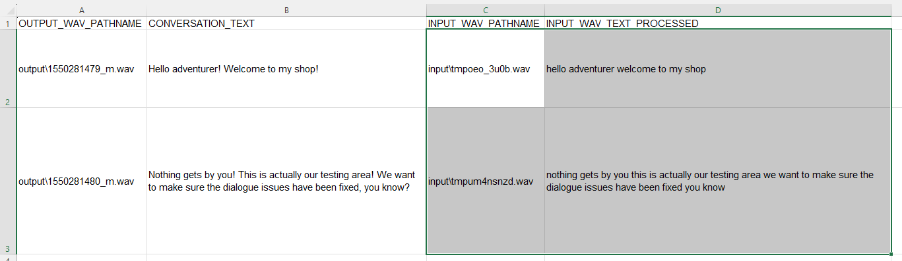

### WAV to Conversation Line Matching for Dragon Age Origins

##### Summary
This is a simple Python tool tested on Python 3.10.15 and CUDA 12.4. This leverage's OpenAI's Whisper package and <tt>turbo</tt> model to build transcriptions of <tt>.wav</tt> files recorded by the user. These transcriptions are then compared to the lines in a <tt>.dlg</tt> conversation file and renamed to the correct convention used by the engine <tt><conversation_string_id_m.wav></tt>.

The goal in this case is to eliminate some of the manual effort needed to key in every filename. In this case, the user can rename all files for a conversation by just supplying the name of their module and the conversation name.

##### Installation
The requirements file is included for installation:

```
pip install -r requirements.txt
```

You will also need to have <tt>ffmpeg.exe</tt> available. If you do not have this, this can be downloaded at https://www.videohelp.com/software/ffmpeg and placed in the root directory of this project.

Lastly, you'll need an ODBC driver to broker the connection to SQL Server. This program uses ODBC Driver 17 for SQL Server https://learn.microsoft.com/en-us/sql/connect/odbc/download-odbc-driver-for-sql-server?view=sql-server-ver17.

##### How to Use
To run the tool, you will need to have created your <tt>.dlg</tt> file in the Dragon Age Toolset so that it is available in your database. After this, record all WAV files needed for the conversation and place them in the <tt>input</tt> folder for this project.

Next, submit the following command from this project's root directory to run the inference. Replace <tt><module_uid></tt> and <tt><conversation_dlg></tt> with the UID of your module and the name of your <tt>.dlg</tt> file without the brackets.

```
python assign_wavs.py -m <module_uid> -c <conversation_dlg>
```

Assuming your inputs are correct, the tool will make the assignments and write the results to the <tt>output</tt> folder. These will be set to the format expected by Dragon Age (24000 Hz, 16-bit) and renamed to what ideally is the correct filename. An <tt>assignments.csv</tt> file will be created so you can review the results.



**If some of the assignments are incorrect**, you can make adjustments using this file. For any incorrect matches, swap the rows in columns C and D to match the correct dialogue from columns A and B. Then, copy this file back into <tt>input</tt> and run this command:

```
python assign_wavs.py -m <module_uid> -c <conversation_dlg> -f
```

This will bypass the transcription component and will force assignments based on whatever is specified in <tt>assignments.csv</tt>.

##### Considerations
Note that this tool uses a hard coded connection string based on common installation settings for SQL Server. If you did a custom installation, this may need to be adjusted within <tt>assign_wavs.py</tt>